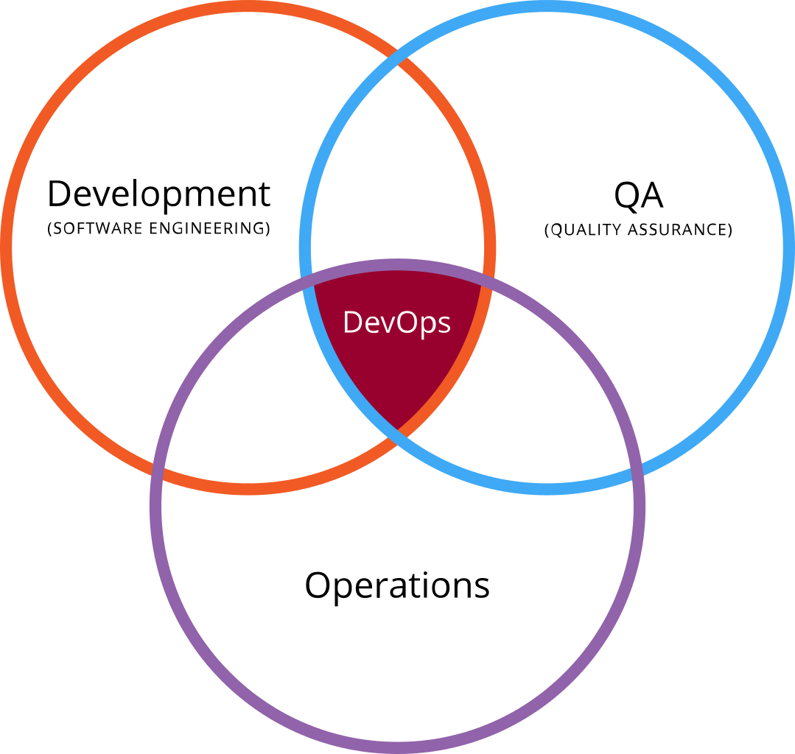

DevOps
===============

### The DevOps way

 

DevOps is an approach to software creation and support that emphasizes transparency and collaboration amongst teams that have typically not worked closely together.

___

 

The goal is to treat software as a continuous flow of concerns rather than a factory line. Each step in the software lifecycle feeds data to the next in a continuous loop.  
Git combined with GitHub, along with an array of integrations, can participate in each of the stages of the DevOps way.

### Resources
 - Wiki page on [Dev Ops](https://en.wikipedia.org/wiki/DevOps)
