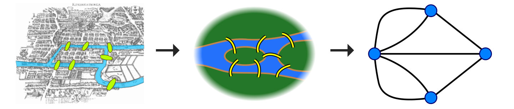
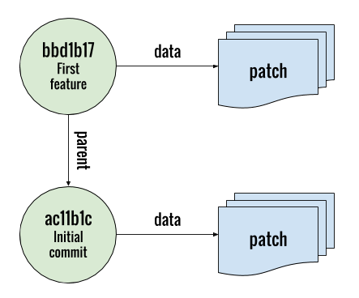
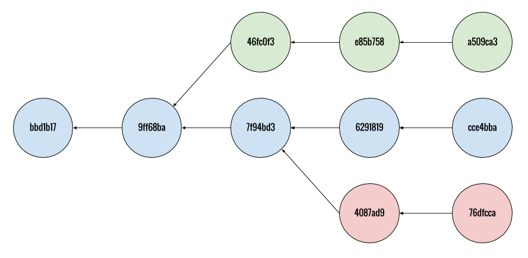

Graph Theory
===============

 - [History](#history)
 - [Directed Graphs](#directed-graphs)
 - [Commits as Nodes](#commits-as-nodes)
 - [Logs as Graphs](#logs-as-graphs)
 - [Referable Pathways](#referable-pathways)
 - [Resources](#resources)

### History

 

In 1736 Leonhard Euler solved a navigation question by creating what eventually becomes graph theory.

___

### Directed Graphs

 

A directed graph consists of nodes and edges that connect nodes with specified directionality. Directionality determines a pathway to reaching nodes.

___

### Commits as Nodes

 
Commits are nodes in a directed graph and typically have:
 - metadata including author, SHA id, message & date created
 - snapshot state of the files the repository manages
 - directed edge towards a parent node

___

### Logs as Graphs

 

Git leverages references in the form of branches and tags. References make commits reachable.

___

### Referable Pathways

 

Commit nodes have edges that point to a parent commit. This, along with branches and tags, form referable pathways through specific snapshots of the repository.

___

### Resources
  - Wiki page on [Directed Graphs](https://en.wikipedia.org/wiki/Directed_graph)
  - Wiki page on [Seven Bridges of Königsberg](https://en.wikipedia.org/wiki/Seven_Bridges_of_K%C3%B6nigsberg)
